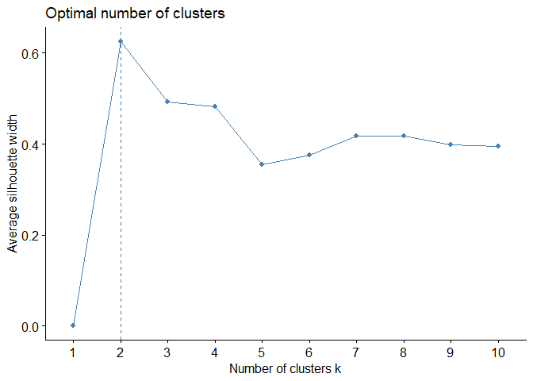

# Clustering Analysis of Bee Eye Data

### Loading Libraries

    packages <- c("tidyverse", "cluster", "dendextend", "factoextra", "gridExtra", "writexl")
    #lapply(packages, library, character.only = TRUE)

### Function to perform hierarchical clustering

    perform_hierarchical_clustering <- function(data, method = "average", k = 3) {
      distance <- dist(data, method = "euclidean")
      cluster <- hclust(distance, method = method)
      plot(cluster, cex = 0.6, hang = -1)
      rect.hclust(cluster, k = k)  # Highlight groups
      return(cluster)
    }

### Function to generate and plot clusters for K-means

    generate_kmeans_clusters <- function(data, centers, title) {
      kmeans_result <- kmeans(data, centers = centers)
      plot <- fviz_cluster(kmeans_result, geom = "point", data = data) + ggtitle(title)
      return(list(model = kmeans_result, plot = plot))
    }

### Function to visualize elbow and silhouette methods

    evaluate_clusters <- function(data, clustering_function) {
      # Elbow method
      elbow_plot <- fviz_nbclust(data, clustering_function, method = "wss")
      print(elbow_plot)  # Exibe o gráfico do Elbow
      
      # Silhouette method
      silhouette_plot <- fviz_nbclust(data, clustering_function, method = "silhouette")
      print(silhouette_plot)  # Exibe o gráfico do Silhouette
    }

### Function to calculate descriptive statistics for clusters

    calculate_means_by_group <- function(data, cluster_column) {
      summary <- data %>%
        group_by(!!sym(cluster_column)) %>%
        summarise(n = n(),
                  ff = mean(ff),
                  df = mean(df),
                  vf = mean(vf),
                  co = mean(co),
                  nf = mean(nf),
                  nfa = mean(nfa),
                  ea = mean(ea),
                  di = mean(di))
      return(summary)
    }

## Hierarchical clustering

### loagind data

    eyes <- read.table("F:/open_git/bee_eyes/data/eyes_df.txt", header = TRUE, sep = "\t")

### Transforming species names into row names

#### Adding a suffix to ensure line names are unique

    row.names(eyes) <- make.unique(as.character(eyes[, 1]))
    eyes <- eyes[, -1]

# Standardizing variables

    eyes_standardized <- scale(eyes[, 2:7])

## Performing hierarchical clustering

    cluster_hierarchical <- perform_hierarchical_clustering(eyes_standardized, method = "average", k = 3)

### Elbow and Silhouette methods for hierarchical clustering

    evaluate_clusters(eyes_standardized, hcut)

### Creating 3 groups of clusters

    group_eyes3 <- cutree(cluster_hierarchical, k = 3)
    eyes$group_eyes3 <- group_eyes3

#### Saving cluster results to an Excel file

    write_xlsx(eyes, "F:/open_git/bee_eyes/results/clustereyes_average_r_.xlsx")

### Performing descriptive analysis by group

    mediagroup <- calculate_means_by_group(eyes, "group_eyes3")
    print(mediagroup)

    ## # A tibble: 3 × 10
    ##   group_eyes3     n    ff    df    vf    co    nf   nfa    ea    di
    ##         <int> <int> <dbl> <dbl> <dbl> <dbl> <dbl> <dbl> <dbl> <dbl>
    ## 1           1    51  34.9  27.5  34.5  421. 4327. 1081.  4.11  3.11
    ## 2           2    16  22.8  17.5  23.6  218. 3834. 2387.  1.78  2.24
    ## 3           3     2  19.5  21    19.6  464. 7819  2010.  3.89  4.75

## Non-hierarchical clustering

### Running K-Means for multiple centers and plotting

    kmeans_results <- list()
    for (k in 2:5) {
      result <- generate_kmeans_clusters(eyes_standardized, centers = k, title = paste("k =", k))
      kmeans_results[[paste0("k", k)]] <- result
    }

### Arranging all K-Means cluster plots on the same screen

    grid.arrange(kmeans_results$k2$plot, kmeans_results$k3$plot,
                 kmeans_results$k4$plot, kmeans_results$k5$plot, nrow = 2)

