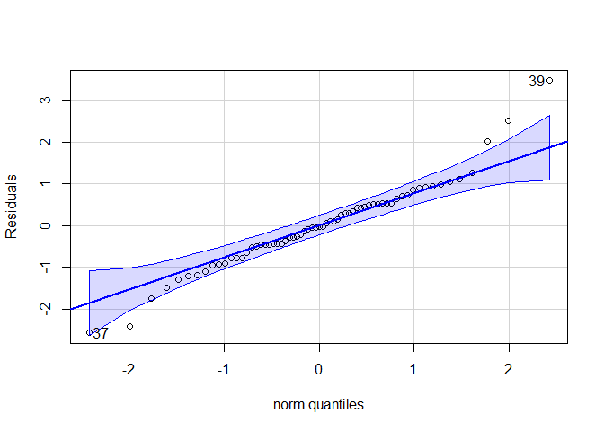
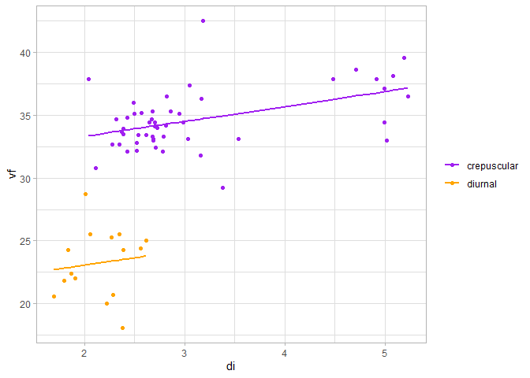
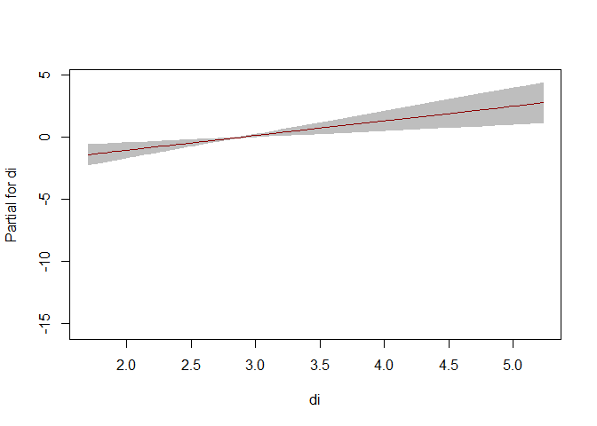
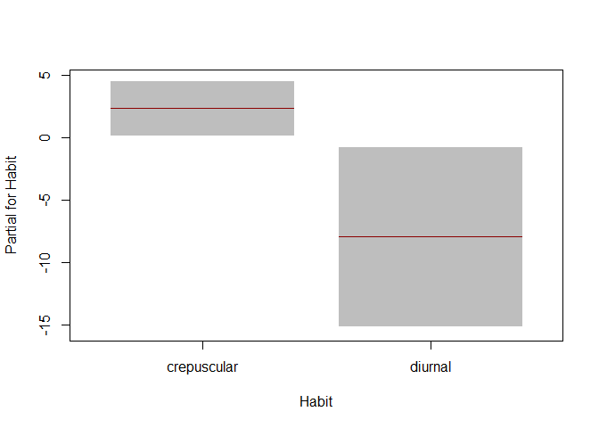

# GAMLSS Analysis of Bee Eyes

### Loading Libraries

    packages <- c('car', 'gamlss')
    #lapply(packages, library, character.only = TRUE)

### Loading and transform data

    # Load the data
    eyes <- read.table("F:/open_git/bee_eyes/data/eyes_df.txt", header = TRUE, sep = "\t")

    # Filter out specific species
    eyes <- eyes[!(eyes$Species %in% c("Cyarrowi", "Coccidentalis")), ]

    # Convert 'Species' to a factor
    eyes$Species <- as.factor(eyes$Species)
    eyes$Habit <- as.factor(eyes$Habit)

    # Explicitly confirm the levels of Habit
    eyes$Habit <- factor(eyes$Habit, levels = c("crepuscular", "diurnal"))

## Function Definitions

### Incremental Model Fitting

The function fit\_incremental\_models incrementally fits mixed models
with random effects, starting with a base model and then adding fixed
effects. An optional complex formula can be provided for a more advanced
model.

    fit_incremental_models <- function(data, response, fixed_effects, random_effect = NULL, complex_formula = NULL) {
      models <- list()
      response_var <- as.formula(paste(response, "~ 1"))  # Base model with intercept only

      # 1. Base Model with Intercept Only
      # This model includes only the intercept, without any fixed or random effects.
      # Model: response ~ 1
      cat("Fitting base model with intercept only...\n")
      models[["m0"]] <- gamlss(response_var, data = data)

      # 2. Model with Random Intercept
      # If a random effect is specified, this model includes the intercept and the random effect.
      # Model: response ~ 1 + (1 | random_effect)
      if (!is.null(random_effect)) {
        random_formula <- as.formula(paste("~ 1 |", random_effect))
        cat("Fitting model with random intercept...\n")
        models[["m1"]] <- gamlss(response_var, random = random_formula, data = data)
      }

      # 3. Incremental Models with Fixed Effects and Random Intercept
      # For each specified fixed effect, a new model is created by adding the effect to the base model with a random intercept.
      for (i in seq_along(fixed_effects)) {
        effect <- fixed_effects[i]
        mu_formula <- update(response_var, paste("~ . +", effect))
        
        # Model: response ~ 1 + fixed_effect1 + ... + fixed_effecti + (1 | random_effect)
        cat("Fitting model with fixed effect:", effect, "...\n")
        models[[paste0("m", i + 2)]] <- gamlss(mu_formula, random = random_formula, data = data)
      }

      # 4. Final Model with Complex Formula
      # If a complex formula is provided, this model uses it with a random intercept.
      # Model: complex_formula + (1 | random_effect)
      if (!is.null(complex_formula)) {
        cat("Fitting complex model (m4)...\n")
        models[["m4"]] <- gamlss(as.formula(complex_formula), random = random_formula, data = data)
      }
      
      return(models)
    }

# Model Summaries and AIC Comparison

These functions provide summaries of each model and compare models based
on AIC values.

    # Function to print model summaries
    print_model_summaries <- function(models) {
      cat("Model Summaries:\n")
      for (name in names(models)) {
        cat("Summary for model", name, ":\n")
        print(summary(models[[name]]))
        cat("\n")
      }
    }

    # Function to compare models based on AIC
    compare_aics <- function(models) {
      aics <- sapply(models, AIC)
      aics_df <- data.frame(Model = names(aics), AIC = aics)
      print(aics_df)
      return(aics_df)
    }

# Running the Incremental Modeling Process

Specify the target variable and fit incremental models, including a
complex model with an interaction term.

    # Example usage
    data <- eyes
    response <- "vf"
    fixed_effects <- c("di")  # Incremental fixed effects
    random_effect <- "Species"
    complex_formula <- "vf ~ di + Habit + di:Habit"  # Complex model formula for m4

    models <- fit_incremental_models(data, response, fixed_effects, random_effect, complex_formula)

    ## Fitting base model with intercept only...
    ## GAMLSS-RS iteration 1: Global Deviance = 403.2616 
    ## GAMLSS-RS iteration 2: Global Deviance = 403.2616 
    ## Fitting model with random intercept...
    ## GAMLSS-RS iteration 1: Global Deviance = 403.2616 
    ## GAMLSS-RS iteration 2: Global Deviance = 403.2616 
    ## Fitting model with fixed effect: di ...
    ## GAMLSS-RS iteration 1: Global Deviance = 379.605 
    ## GAMLSS-RS iteration 2: Global Deviance = 379.605 
    ## Fitting complex model (m4)...
    ## GAMLSS-RS iteration 1: Global Deviance = 289.4782 
    ## GAMLSS-RS iteration 2: Global Deviance = 289.4782

    print_model_summaries(models)

    ## Model Summaries:
    ## Summary for model m0 :
    ## ******************************************************************
    ## Family:  c("NO", "Normal") 
    ## 
    ## Call:  gamlss(formula = response_var, data = data) 
    ## 
    ## Fitting method: RS() 
    ## 
    ## ------------------------------------------------------------------
    ## Mu link function:  identity
    ## Mu Coefficients:
    ##             Estimate Std. Error t value Pr(>|t|)    
    ## (Intercept)  31.9938     0.6676   47.93   <2e-16 ***
    ## ---
    ## Signif. codes:  0 '***' 0.001 '**' 0.01 '*' 0.05 '.' 0.1 ' ' 1
    ## 
    ## ------------------------------------------------------------------
    ## Sigma link function:  log
    ## Sigma Coefficients:
    ##             Estimate Std. Error t value Pr(>|t|)    
    ## (Intercept)  1.68307    0.08771   19.19   <2e-16 ***
    ## ---
    ## Signif. codes:  0 '***' 0.001 '**' 0.01 '*' 0.05 '.' 0.1 ' ' 1
    ## 
    ## ------------------------------------------------------------------
    ## No. of observations in the fit:  65 
    ## Degrees of Freedom for the fit:  2
    ##       Residual Deg. of Freedom:  63 
    ##                       at cycle:  2 
    ##  
    ## Global Deviance:     403.2616 
    ##             AIC:     407.2616 
    ##             SBC:     411.6104 
    ## ******************************************************************
    ##              Estimate Std. Error  t value     Pr(>|t|)
    ## (Intercept) 31.993846 0.66756425 47.92624 2.748998e-51
    ## (Intercept)  1.683074 0.08770574 19.19001 5.233104e-28
    ## 
    ## Summary for model m1 :
    ## ******************************************************************
    ## Family:  c("NO", "Normal") 
    ## 
    ## Call:  gamlss(formula = response_var, data = data, random = random_formula) 
    ## 
    ## Fitting method: RS() 
    ## 
    ## ------------------------------------------------------------------
    ## Mu link function:  identity
    ## Mu Coefficients:
    ##             Estimate Std. Error t value Pr(>|t|)    
    ## (Intercept)  31.9938     0.6676   47.93   <2e-16 ***
    ## ---
    ## Signif. codes:  0 '***' 0.001 '**' 0.01 '*' 0.05 '.' 0.1 ' ' 1
    ## 
    ## ------------------------------------------------------------------
    ## Sigma link function:  log
    ## Sigma Coefficients:
    ##             Estimate Std. Error t value Pr(>|t|)    
    ## (Intercept)  1.68307    0.08771   19.19   <2e-16 ***
    ## ---
    ## Signif. codes:  0 '***' 0.001 '**' 0.01 '*' 0.05 '.' 0.1 ' ' 1
    ## 
    ## ------------------------------------------------------------------
    ## No. of observations in the fit:  65 
    ## Degrees of Freedom for the fit:  2
    ##       Residual Deg. of Freedom:  63 
    ##                       at cycle:  2 
    ##  
    ## Global Deviance:     403.2616 
    ##             AIC:     407.2616 
    ##             SBC:     411.6104 
    ## ******************************************************************
    ##              Estimate Std. Error  t value     Pr(>|t|)
    ## (Intercept) 31.993846 0.66756425 47.92624 2.748998e-51
    ## (Intercept)  1.683074 0.08770574 19.19001 5.233104e-28
    ## 
    ## Summary for model m3 :
    ## ******************************************************************
    ## Family:  c("NO", "Normal") 
    ## 
    ## Call:  gamlss(formula = mu_formula, data = data, random = random_formula) 
    ## 
    ## Fitting method: RS() 
    ## 
    ## ------------------------------------------------------------------
    ## Mu link function:  identity
    ## Mu Coefficients:
    ##             Estimate Std. Error t value Pr(>|t|)    
    ## (Intercept)  22.6009     1.8443  12.254  < 2e-16 ***
    ## di            3.2623     0.6107   5.342 1.39e-06 ***
    ## ---
    ## Signif. codes:  0 '***' 0.001 '**' 0.01 '*' 0.05 '.' 0.1 ' ' 1
    ## 
    ## ------------------------------------------------------------------
    ## Sigma link function:  log
    ## Sigma Coefficients:
    ##             Estimate Std. Error t value Pr(>|t|)    
    ## (Intercept)  1.50110    0.08771   17.11   <2e-16 ***
    ## ---
    ## Signif. codes:  0 '***' 0.001 '**' 0.01 '*' 0.05 '.' 0.1 ' ' 1
    ## 
    ## ------------------------------------------------------------------
    ## No. of observations in the fit:  65 
    ## Degrees of Freedom for the fit:  3
    ##       Residual Deg. of Freedom:  62 
    ##                       at cycle:  2 
    ##  
    ## Global Deviance:     379.605 
    ##             AIC:     385.605 
    ##             SBC:     392.1281 
    ## ******************************************************************
    ##              Estimate Std. Error   t value     Pr(>|t|)
    ## (Intercept) 22.600916 1.84433733 12.254220 3.261999e-18
    ## di           3.262305 0.61071087  5.341816 1.392671e-06
    ## (Intercept)  1.501100 0.08770574 17.115182 3.580938e-25
    ## 
    ## Summary for model m4 :
    ## ******************************************************************
    ## Family:  c("NO", "Normal") 
    ## 
    ## Call:  gamlss(formula = as.formula(complex_formula), data = data,  
    ##     random = random_formula) 
    ## 
    ## Fitting method: RS() 
    ## 
    ## ------------------------------------------------------------------
    ## Mu link function:  identity
    ## Mu Coefficients:
    ##                  Estimate Std. Error t value Pr(>|t|)    
    ## (Intercept)      30.94459    1.11225  27.822  < 2e-16 ***
    ## di                1.18654    0.34415   3.448  0.00104 ** 
    ## Habitdiurnal    -10.33130    4.64661  -2.223  0.02997 *  
    ## di:Habitdiurnal   0.03443    2.10802   0.016  0.98702    
    ## ---
    ## Signif. codes:  0 '***' 0.001 '**' 0.01 '*' 0.05 '.' 0.1 ' ' 1
    ## 
    ## ------------------------------------------------------------------
    ## Sigma link function:  log
    ## Sigma Coefficients:
    ##             Estimate Std. Error t value Pr(>|t|)    
    ## (Intercept)  0.80782    0.08771   9.211 4.37e-13 ***
    ## ---
    ## Signif. codes:  0 '***' 0.001 '**' 0.01 '*' 0.05 '.' 0.1 ' ' 1
    ## 
    ## ------------------------------------------------------------------
    ## No. of observations in the fit:  65 
    ## Degrees of Freedom for the fit:  5
    ##       Residual Deg. of Freedom:  60 
    ##                       at cycle:  2 
    ##  
    ## Global Deviance:     289.4782 
    ##             AIC:     299.4782 
    ##             SBC:     310.3502 
    ## ******************************************************************
    ##                     Estimate Std. Error    t value     Pr(>|t|)
    ## (Intercept)      30.94458501 1.11224714 27.8216810 5.439559e-36
    ## di                1.18653635 0.34415498  3.4476803 1.039416e-03
    ## Habitdiurnal    -10.33129894 4.64661392 -2.2234038 2.996587e-02
    ## di:Habitdiurnal   0.03443387 2.10801951  0.0163347 9.870216e-01
    ## (Intercept)       0.80781714 0.08770574  9.2105387 4.373208e-13

    compare_aics(models)

    ##    Model      AIC
    ## m0    m0 407.2616
    ## m1    m1 407.2616
    ## m3    m3 385.6050
    ## m4    m4 299.4782

    ##    Model      AIC
    ## m0    m0 407.2616
    ## m1    m1 407.2616
    ## m3    m3 385.6050
    ## m4    m4 299.4782

# Diagnostic and Visualization Functions

## Model Diagnostics

Functions to display diagnostic plots, model coefficients, and R-squared
values for the final model.

    # Function to display diagnostic plots and R-squared
    diagnostic_plots <- function(model) {
      qqPlot(residuals(model), ylab = "Residuals")
      cat("Model R-squared:", Rsq(model), "\n")
    }

    # Function to get final model coefficients
    get_final_model_coefs <- function(model) {
      coefs <- coef(model)
      print(coefs)
      return(coefs)
    }

    # Apply diagnostic functions to the final model
    final_model <- models[["m4"]]
    get_final_model_coefs(final_model)

    ##     (Intercept)              di    Habitdiurnal di:Habitdiurnal 
    ##     30.94458501      1.18653635    -10.33129894      0.03443387

    ##     (Intercept)              di    Habitdiurnal di:Habitdiurnal 
    ##     30.94458501      1.18653635    -10.33129894      0.03443387

    diagnostic_plots(final_model)

    ## Model R-squared: 0.8263153

# Predicted vs Observed Plot by Habit

This function plots observed versus predicted values with separate lines
for each level of Habit.

    library(ggplot2)

    #Model with lowest AIC
    m4 <- gamlss(vf ~ di + Habit + di:Habit, random = di | Species, data = eyes)

    ## GAMLSS-RS iteration 1: Global Deviance = 289.4782 
    ## GAMLSS-RS iteration 2: Global Deviance = 289.4782

    # Function to plot observed vs predicted values by group
    plot_observed_vs_predicted <- function(model, data, x_var, y_var, group_var = "Habit") {
      # Remove rows with NA in relevant columns
      data <- data[complete.cases(data[, c(x_var, y_var, group_var)]), ]
      
      # Add predicted values to data
      data$predicted <- predict(model, newdata = data, type = "response")
      
      # Generate plot
      ggplot(data, aes_string(x = x_var, group = group_var)) +
        geom_point(aes_string(y = y_var, color = group_var), shape = 16) +  # Observed points
        geom_line(aes_string(y = "predicted", color = group_var), linewidth = 1) +  # Predicted lines
        theme_light() +
        labs(x = x_var, y = y_var, color = group_var) +
        scale_color_manual(values = c("crepuscular" = "purple", "diurnal" = "orange")) +
        theme(legend.title = element_blank())
    }

    # Example usage for plotting
    plot_observed_vs_predicted(model = m4, data = eyes, x_var = "di", y_var = "vf", group_var ="Habit")

    ## Warning: `aes_string()` was deprecated in ggplot2 3.0.0.
    ## ℹ Please use tidy evaluation idioms with `aes()`.
    ## ℹ See also `vignette("ggplot2-in-packages")` for more information.
    ## This warning is displayed once every 8 hours.
    ## Call `lifecycle::last_lifecycle_warnings()` to see where this warning was
    ## generated.

# Additional Plots

    # Plot term plot for final model
    term.plot(m4)

    ## Warning in term.plot(m4): interactions have been taken out from the plots

