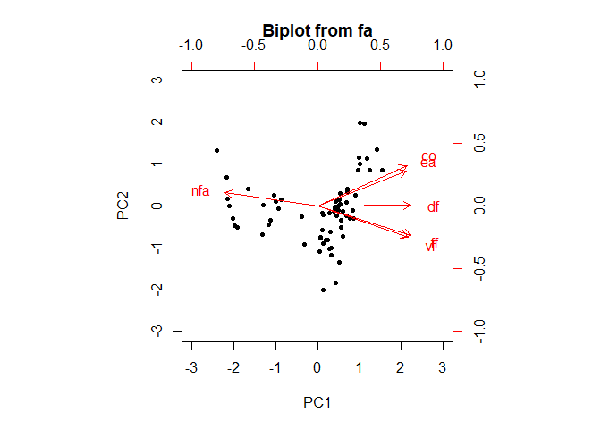
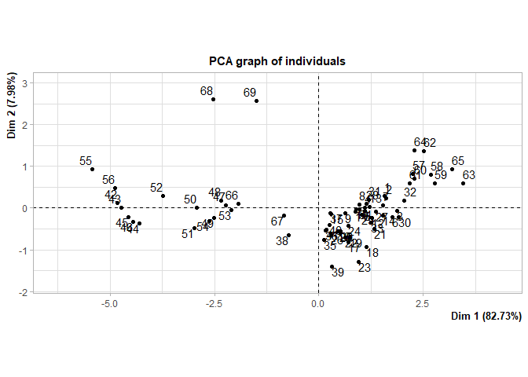
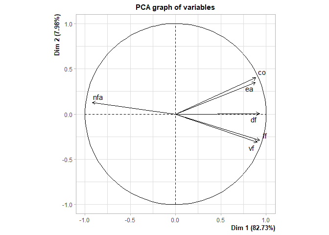
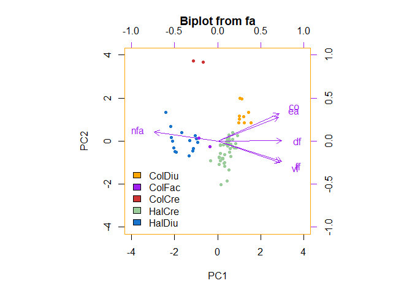

### Loading Libraries

    packages <- c("tidyverse", "REdaS", "psych", "FactoMineR", "factoextra", "writexl")
    #lapply(packages, library, character.only = TRUE)

### Loading and Preparing Data

    eyes <- read.table("F:/open_git/bee_eyes/data/eyes_df.txt", header = TRUE, sep = "\t")

#### Converting the FamHab column to a factor

    eyes$FamHab <- as.factor(eyes$FamHab)

#### Data summary

    summary(eyes)

    ##    Species                nf             vf              ff       
    ##  Length:69          Min.   :2257   Min.   :17.60   Min.   :17.40  
    ##  Class :character   1st Qu.:3776   1st Qu.:29.20   1st Qu.:26.10  
    ##  Mode  :character   Median :4061   Median :33.30   Median :34.30  
    ##                     Mean   :4314   Mean   :31.55   Mean   :31.62  
    ##                     3rd Qu.:4531   3rd Qu.:35.10   3rd Qu.:35.60  
    ##                     Max.   :7987   Max.   :42.50   Max.   :38.90  
    ##        df             co              ea             nfa        
    ##  Min.   :13.6   Min.   :153.2   Min.   :0.870   Min.   : 876.7  
    ##  1st Qu.:21.0   1st Qu.:317.5   1st Qu.:2.740   1st Qu.: 987.9  
    ##  Median :26.2   Median :387.8   Median :3.630   Median :1094.4  
    ##  Mean   :25.0   Mean   :375.3   Mean   :3.566   Mean   :1410.6  
    ##  3rd Qu.:28.1   3rd Qu.:440.7   3rd Qu.:4.220   3rd Qu.:1694.9  
    ##  Max.   :36.1   Max.   :620.8   Max.   :6.830   Max.   :3606.9  
    ##        di           Habit              Family             FamHab  
    ##  Min.   :1.700   Length:69          Length:69          ColCre: 9  
    ##  1st Qu.:2.380   Class :character   Class :character   ColDiu: 2  
    ##  Median :2.680   Mode  :character   Mode  :character   ColFac: 2  
    ##  Mean   :2.952                                         HalCre:41  
    ##  3rd Qu.:3.160                                         HalDiu:15  
    ##  Max.   :5.230

### Principal Component Analysis (PCA)

##### Bartlett’s test to check the adequacy of factor analysis

    cortest.bartlett(eyes[, 3:8])

    ## R was not square, finding R from data

    ## $chisq
    ## [1] 496.0858
    ## 
    ## $p.value
    ## [1] 3.802837e-96
    ## 
    ## $df
    ## [1] 15

### Calculating Principal Components

#### PCA without Rotation

    components_without_rotation <- principal(eyes[, 3:8], nfactors=2, rotate="none", scores=TRUE)

#### Visualizing the components

    components_without_rotation

    ## Principal Components Analysis
    ## Call: principal(r = eyes[, 3:8], nfactors = 2, rotate = "none", scores = TRUE)
    ## Standardized loadings (pattern matrix) based upon correlation matrix
    ##       PC1   PC2   h2    u2 com
    ## vf   0.90 -0.31 0.91 0.088 1.2
    ## ff   0.93 -0.29 0.95 0.047 1.2
    ## df   0.93  0.01 0.86 0.140 1.0
    ## co   0.89  0.40 0.95 0.049 1.4
    ## ea   0.88  0.35 0.90 0.098 1.3
    ## nfa -0.92  0.13 0.86 0.136 1.0
    ## 
    ##                        PC1  PC2
    ## SS loadings           4.96 0.48
    ## Proportion Var        0.83 0.08
    ## Cumulative Var        0.83 0.91
    ## Proportion Explained  0.91 0.09
    ## Cumulative Proportion 0.91 1.00
    ## 
    ## Mean item complexity =  1.2
    ## Test of the hypothesis that 2 components are sufficient.
    ## 
    ## The root mean square of the residuals (RMSR) is  0.04 
    ##  with the empirical chi square  2.63  with prob <  0.62 
    ## 
    ## Fit based upon off diagonal values = 1

### Biplot (No Rotation)

    biplot(components_without_rotation)

    components_without_rotation_1 <- PCA(eyes[, 3:8], scale.unit = TRUE, graph = TRUE, ncp=2)

    summary(components_without_rotation_1)

    ## 
    ## Call:
    ## PCA(X = eyes[, 3:8], scale.unit = TRUE, ncp = 2, graph = TRUE) 
    ## 
    ## 
    ## Eigenvalues
    ##                        Dim.1   Dim.2   Dim.3   Dim.4   Dim.5   Dim.6
    ## Variance               4.964   0.479   0.235   0.181   0.080   0.061
    ## % of var.             82.734   7.984   3.913   3.016   1.335   1.018
    ## Cumulative % of var.  82.734  90.718  94.631  97.647  98.982 100.000
    ## 
    ## Individuals (the 10 first)
    ##         Dist    Dim.1    ctr   cos2    Dim.2    ctr   cos2  
    ## 1   |  1.752 |  1.578  0.727  0.811 |  0.280  0.238  0.026 |
    ## 2   |  1.658 |  1.612  0.758  0.945 |  0.238  0.171  0.021 |
    ## 3   |  1.938 |  1.870  1.021  0.931 | -0.073  0.016  0.001 |
    ## 4   |  1.133 |  1.095  0.350  0.934 |  0.004  0.000  0.000 |
    ## 5   |  1.149 |  1.101  0.354  0.918 | -0.069  0.015  0.004 |
    ## 6   |  1.867 |  1.763  0.908  0.892 | -0.212  0.136  0.013 |
    ## 7   |  1.582 |  1.534  0.687  0.940 |  0.064  0.013  0.002 |
    ## 8   |  1.023 |  0.970  0.274  0.898 |  0.075  0.017  0.005 |
    ## 9   |  0.730 |  0.626  0.114  0.736 | -0.118  0.042  0.026 |
    ## 10  |  0.974 |  0.902  0.237  0.857 | -0.025  0.002  0.001 |
    ## 
    ## Variables
    ##        Dim.1    ctr   cos2    Dim.2    ctr   cos2  
    ## vf  |  0.904 16.468  0.817 | -0.308 19.839  0.095 |
    ## ff  |  0.932 17.494  0.868 | -0.292 17.762  0.085 |
    ## df  |  0.928 17.331  0.860 |  0.005  0.006  0.000 |
    ## co  |  0.889 15.916  0.790 |  0.401 33.566  0.161 |
    ## ea  |  0.883 15.715  0.780 |  0.349 25.361  0.121 |
    ## nfa | -0.921 17.077  0.848 |  0.129  3.466  0.017 |

### PCA Metrics

#### eingvalues

    components_without_rotation$values

    ## [1] 4.96403183 0.47906831 0.23477737 0.18094934 0.08011495 0.06105819

#### Variability Explained

    PC1 <- components_without_rotation$Vaccounted[2, 1]
    PC2 <- components_without_rotation$Vaccounted[2, 2]
    PC1; PC2

    ## [1] 0.8273386

    ## [1] 0.07984472

#### Factor Loadings and Scores

    components_without_rotation$weights

    ##            PC1         PC2
    ## vf   0.1821367 -0.64351851
    ## ff   0.1877268 -0.60890582
    ## df   0.1868500  0.01107227
    ## co   0.1790591  0.83704824
    ## ea   0.1779249  0.72758555
    ## nfa -0.1854768  0.26897867

    components_without_rotation$loadings

    ## 
    ## Loadings:
    ##     PC1    PC2   
    ## vf   0.904 -0.308
    ## ff   0.932 -0.292
    ## df   0.928       
    ## co   0.889  0.401
    ## ea   0.883  0.349
    ## nfa -0.921  0.129
    ## 
    ##                  PC1   PC2
    ## SS loadings    4.964 0.479
    ## Proportion Var 0.827 0.080
    ## Cumulative Var 0.827 0.907

### Factorial Scores and Ranking

#### Calculating Factor Scores

    eyes_without_rotation <- eyes
    eyes_without_rotation$scores_PCA1 <- components_without_rotation$scores[, 1]
    eyes_without_rotation$scores_PCA2 <- components_without_rotation$scores[, 2]

#### Creating a Ranking Based on PCA Scores

    eyes_without_rotation <- eyes_without_rotation %>% 
      mutate(ranking = (PC1 * scores_PCA1) + (PC2 * scores_PCA2)) %>% 
      arrange(desc(ranking))

    head(eyes_without_rotation)

    ##          Species   nf   vf   ff   df     co   ea     nfa   di       Habit
    ## 1     Zmegalopta 5167 39.6 37.9 35.1 582.10 5.39  958.27 5.19 crepuscular
    ## 2     Zmegalopta 4923 36.5 36.6 36.1 601.90 5.09  967.76 5.23 crepuscular
    ## 3 Platecalcarata 6052 38.6 38.9 26.2 511.44 6.49  932.51 4.71 crepuscular
    ## 4     Zmegalopta 5823 34.4 34.0 32.0 587.00 5.47 1064.34 4.99 crepuscular
    ## 5 Platecalcarata 6206 37.1 37.0 28.1 478.00 6.83  908.11 4.99 crepuscular
    ## 6     Zmegalopta 4061 33.0 32.6 32.0 620.80 4.57  889.21 5.02 crepuscular
    ##       Family FamHab scores_PCA1 scores_PCA2  ranking
    ## 1 colletidae ColCre    1.537893   0.8505000 1.340266
    ## 2 colletidae ColCre    1.426491   1.3396003 1.287151
    ## 3 colletidae ColCre    1.235456   0.8538441 1.090315
    ## 4 colletidae ColCre    1.120428   1.9584863 1.083348
    ## 5 colletidae ColCre    1.191929   1.1318163 1.076498
    ## 6 colletidae ColCre    1.020092   1.9855089 1.002494

#### Exporting the Ranking to Exce

    write_xlsx(eyes_without_rotation, "F:/open_git/bee_eyes/results/ranking_pca.xlsx")

### Custom Biplot Visualization

    biplot(components_without_rotation, pch = c(21, 21, 21, 21, 21), 
           col = c("orange", "purple", "brown3", "darkseagreen3", "dodgerblue3"), 
           group = eyes$FamHab, ylim.s = c(-4, 4), xlim.s = c(-4, 4))

    legend("bottomleft", fill = c("orange", "purple", "brown3", "darkseagreen3", "dodgerblue3"), 
           horiz = FALSE, c("ColDiu", "ColFac", "ColCre", "HalCre", "HalDiu"), cex = 1, bty = "n")

